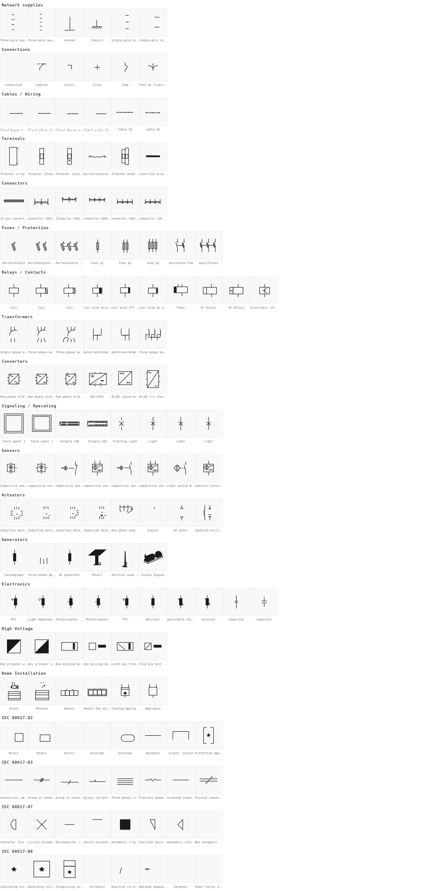
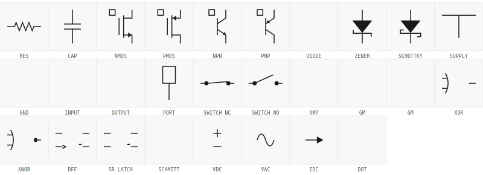

# draw.io-electrical

IEC electrical schematic symbols for draw.io/diagrams.net, converted from the
[QElectroTech elements library](https://github.com/qelectrotech/qelectrotech-elements).



## Import

### IEC library (converted from QElectroTech)

Import individual category files from `libraries/categorized/`:

1. In draw.io: **File → Open Library…** (desktop) or **File → Open Library from → This Device** (web)
2. Pick one or more files from `libraries/categorized/` (e.g. `IEC Electrical - Terminals.xml`)
3. Each file appears as a separate **"IEC Electrical - …"** panel in the sidebar

Alternatively, use the single combined file `libraries/combined/IEC_Electrical.xml`
for a one-click import of all symbols in a single panel.

### Using with AI / MCP

`libraries/categorized/stencils/` contains per-category `<shapes>` stencil files and
`libraries/mcp_context.md` lists all shape names grouped by category.

To use IEC symbols with the draw.io MCP:

1. Register stencils in draw.io (web version: **Extras → Edit Stencils**) — load files from `libraries/categorized/stencils/`
2. Provide `libraries/mcp_context.md` as context to your AI — it contains all available shape names
3. Reference shapes in cell styles as `shape=stencil(NAME)` where NAME is from the context file

> **Note:** Stencil registration via *Extras → Edit Stencils* is available in the draw.io web version. The desktop app does not expose this menu item; use the mxlibrary files (`libraries/categorized/`) instead, which work in both web and desktop.

### Original hand-crafted library

`Custom_Electrical.xml` is a smaller, manually created symbol set included in this repo. Import it the same way if you prefer it or want both libraries loaded at once.



### Troubleshooting

**All symbols appear on the drawing canvas instead of the shape panel**

This happens when the file is opened as a diagram instead of a library. Causes:

- Used **File → Open** (or dragged the `.xml` onto the canvas) instead of **File → Open Library from → This Device**.
- The `.xml` file is malformed — a valid library file starts with `<mxlibrary>[`.

Fix: press `Ctrl+Z` to undo, then re-import via the correct menu path.

### Uninstalling a library

In draw.io: right-click the library's title bar in the shape panel and select **Close Library** (or click the **×** next to its name). This removes it from the sidebar for the current session. To prevent it from reloading in future sessions, do not re-import it.

## Releases

Pre-built library files are published as [GitHub Releases](../../releases).
Each release page lists all assets with descriptions of what each file is for.

A **`latest`** pre-release is updated automatically on every commit to `main`.
Versioned releases use [CalVer](https://calver.org/) in `YY.MM` format, with an optional `.N`
patch suffix for same-month re-releases (e.g. `26.03`, `26.03.1`).

To cut a release:

```bash
git tag 26.03
git push origin 26.03
```

## Building from source

The pre-built library files in `libraries/` are ready to use without building. Building from source is only needed if you want to regenerate the libraries (e.g. after updating the submodule or modifying the conversion tools).

Requires Python 3 and MSYS2/Git Bash (or Linux/macOS).

After cloning, initialize the submodule:

```bash
git submodule update --init --recursive
```

Then build:

```bash
bash tools/build_iec_library.sh
```

Outputs into `libraries/` in the repo root:
- `libraries/categorized/` — one mxlibrary file per symbol category
- `libraries/categorized/stencils/` — matching `<shapes>` stencil files
- `libraries/mcp_context.md` — shape name reference for AI/MCP use

To also build the single combined library into `libraries/combined/`:

```bash
bash tools/build_iec_library.sh --combined
```

## Regenerating symbol previews

After rebuilding the libraries, regenerate the preview images with:

```bash
# IEC library preview  ->  screenshots/symbols_iec.svg
python tools/render_preview.py

# Hand-crafted library preview  ->  screenshots/symbols_custom.svg
python tools/render_custom_preview.py
```
